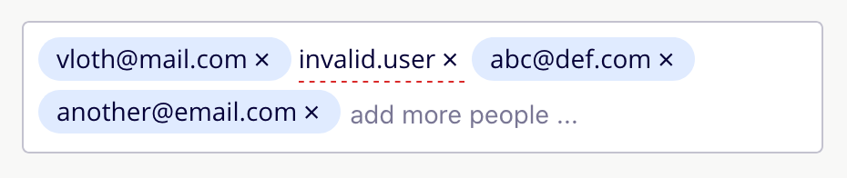

## Emails Input &middot; 
Vanilla js implementation of emails input: a component to help fill emails in.



[Click here for a live demo](https://vloth.github.io/emails-input/) _(there is a global `emailsInput` object to play with)_ 
or [here](https://vloth.github.io/emails-input/examples.html) to look some examples.

## Goals
- vanilla js, zero dependency, no module bundlers, polyfills, libraries or frameworks;
- works in IE 11 and latest versions of Chrome, Safari, Firefox, and Edge;
- automated tests using jsdom;

## API

- [EmailsInput(node, options)](#emailsinput)
  - [#getValue(options)](#getvalue)
  - [#add(email)](#add)
  - [#remove(email)](#remove)
  - [#destroy()](#destroy)


## EmailsInput
Mounts EmailsInput in the node:
```js
  const inputContainerNode = document.querySelector('#emails-input')
  const emailsInput = EmailsInput(inputContainerNode)
```
Optional config arguments:
| Key                    | Description                                             | Default Argument    |
|------------------------|---------------------------------------------------------|---------------------|
| placeholder            | the placeholder of the input                            | add more people ... |
| triggerKeyCodes        | [key codes][key_code] to trigger the creation of a chip | [44,13]             |
| pasteSplitPattern&ast; | split pattern to be used when pasting a content         | /(?:,\| )+/         |  


_&ast;(creating chips on paste only works on browsers that support the clipboard api, ie: it doesn't support IE11)_

## getValue
Gets an array of emails. By default, only valid emails will be returned, but an optional argument can be supplied to retrieve all emails:
```js
  const emails = emailsInput.getValue()
  // ["vloth@mail.com", "abc@def.com", "another@email.com"]

  const emails = emailsInput.getValue({ includeInvalid: true })
  // ["vloth@mail.com", "invalid.user", "abc@def.com", "another@email.com"]
```

## add
Adds an email to the input
```js
  emailsInput.add('yet-another@email.com')
```

## remove
Removes an email from the input
```js
  emailsInput.remove('yet-another@email.com')
```

## destroy
Unmounts the component from the dom, and cleans up all handlers:
```js
  emailsInput.destroy()
```

[key_code]: https://developer.mozilla.org/en-US/docs/Web/API/KeyboardEvent/keyCode

## License

MIT © 2020
